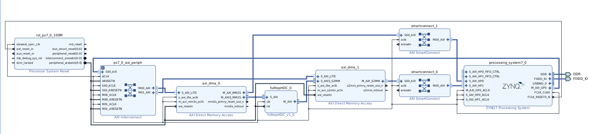

### Description of HDC IP Implementation on PYNQ-Z2 Board

The following diagram shows the implementation of the HDC IP core on the PYNQ-Z2 board. This configuration allows Jupyter Notebook to easily manage data and interaction from the user to the FPGA. This setup is perfect for IoT and low-power device applications.

Here you will find a detailed breakdown of the components and their interfaces:
1. **Processor System Reset (rst_ps7_0_100M)**
 - Provides various reset signals to ensure synchronized system startup and stability.

2. **Processor system (processing_system7_0)**
 - Acts as the central processing unit based on the Zynq-7000 SoC and integrates ARM Cortex-A9 processors and FPGA fabric.
 - Handles high-speed data transfer via AXI HP (High Performance) ports and interfaces with DDR and fixed IO connections for memory and peripheral management.

3. **AXI Interconnect (ps7_0_axi_periph)**
 - Manages the connection between the processing system and AXI-based peripherals and facilitates data transfer and communication within the system.

4. **Direct Memory Access (DMA) and the DMA Controllers**
 - **axi_dma_0** and **axi_dma_1**
 - Enable efficient data transfer between the Jupyter Notbook and the HDC IP Core without processor intervention.
 - Enable the high-speed data transfer required for real-time HDC processing.

5. **FulltopHDC (fulltopHDC_v1_0)**
 - Represents the HDC IP core as an HDC accelerator.
 - Interacts with other system components via AXI interfaces to receive and process data and return results.

6. **AXI SmartConnect (smartconnect_0 and smartconnect_1)**
 - Provide flexible and efficient connections between multiple AXI masters and slaves and ensure optimized data routing.

### Workflow Description

In the inferencing phase:
 - Data is transferred to the FPGA via Jupyter Notebook, using the processor and AXI DMA for data transfer to the HDC IP core.
 - The HDC IP core (fulltopHDC_v1_0) processes the data and calculates the classification result.
 - The processor and the AXI DMA receive the results from HDC IP and transfer them back to the Jupyter Notebook, which performs the calculations in real time.

