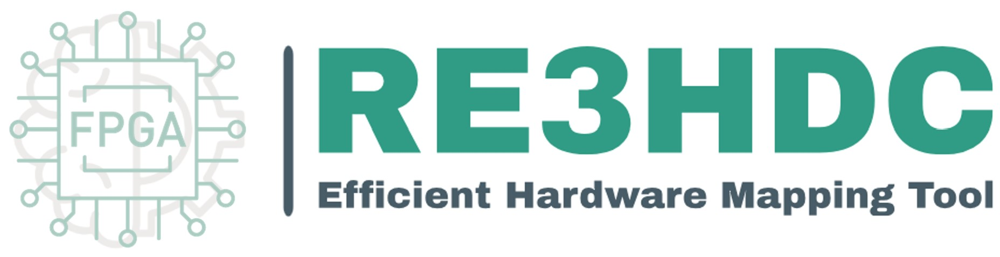
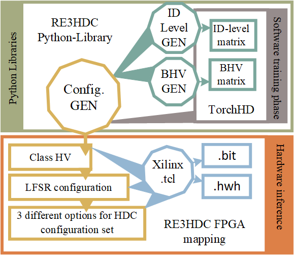

Welcome to the RCEHDC documentation!
=====================================

The reconfigurable Energy Efficient Encoding HDC (RCEHDC) is a framework dedicated to mapping *Hyperdimensional Computing* (HDC) also known as *binary Vector Symbolic Architectures* (VSA) to FPGA.
The RCEHDC project is an experimental framework for the implementation of HDC on Xilinx FPGA boards. The main components of RCEHDC are shown in the figure below and can be described as follows:




- **End-to-End Framework**
  - Uses an open source HDC training library ([Torchhd[^1]](https://github.com/torchhd))
  - Automatically generates a bitstream and hardware files for inferencing

- **Adjustable Pipeline and Fully Reconfigurable Hardware Architecture**
  - Parameterized hardware in VHDL
  - Scales based on problem size
  - Suitable for various problems without changing hardware discription by setting generic parameters and initial values
  
- **Automatic Optimization**
  - Optimizes HDC model for efficient hardware mapping by generating memory parameters on-the-fly 
  - Eliminates ineffective elements without sacrificing accuracy

[^1]: [Torchhd](https://github.com/torchhd)

RE3HDC tutorials Resources
===================
- [getting_started with RCEHDC](/docs/getstarted.md)
- [RCEHDC examples repository](/mnist_example)  
- [RCEHDC encoding](/docs/_encoding.md)
- [RCEHDC architetcure and pipelining](/docs/hardware_over.md)
- [RCEHDC hardware structure and paramiter generating](/docs/hardware_param.md)
- [hardware description modeling](/docs/hardware_desc.md)
- [end_to_end_flow](/docs/end_to_end.md)
- [HDC IP Implementation on PYNQ-Z2 Board](/docs/HDC_ON_PYNQ.md)
- [list of publications](/docs/publications.md)

Task List
------------
- [ ] add random projection and permitation encodings
- [ ] add more boards options to tcl
- [ ] add non-bainary classification support
- [ ] modify the TKEEP signal

If you are using our framework, please cite:
```
@inproceedings{roodsari2024otfgencoder,
  title={OTFGEncoder-HDC: Hardware-efficient Encoding Techniques for Hyperdimensional Computing},
  author={Roodsari, Mahboobe Sadeghipour and Krautter, Jonas and Tahoori, Mehdi},
  booktitle={2024 Design, Automation \& Test in Europe Conference \& Exhibition (DATE)},
  pages={1--2},
  year={2024},
  organization={IEEE}
}
```

 
