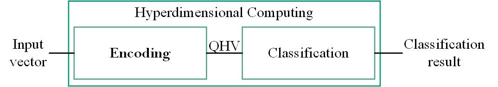
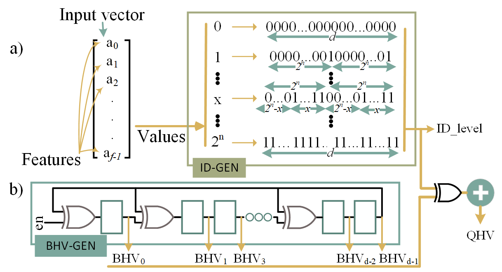

HDC Background
====================

HDC can be divided into two main components: Enoding and Classification. In the first part, the input is transferred into a hyperdimensional space, which is called Query HyperVector (QHV). During classification, the most similar class to QHV is then selected as the classification candidate.

HDC encoding
====================
Most HDC encoding approaches are based on one of the following principles: random projection, base-level, and permutation.
The common operations for all approaches are _binding_, where each of the _f_ features of the input is transformed into an HV, and _bundling_, where the _f_ generated HVs are summed up and binarized.
In the following table the basic ideas of encoding thecnique as well as the advantages and disadvantages, mainly in terms of memory utilization and computational complexity is compared.

| Encoding            | ID matrix | BV matrix | Equation                                                                 | Required memory (bits)  | Operations                   |
|---------------------|-----------|-----------|--------------------------------------------------------------------------|--------------------------|------------------------------|
| Random projection   | ❌        | ✅        | $QHV=binarized(\sum_{k=1}^f IF_{k}\times BHV_{k})$                                                        | F × D                    | Matrix multiplication        |
| Base level          | ✅        | ✅        | $QHV=binarized(\sum_{k=1}^f ID\_level_{k}\otimes BHV_{k})$                     | 2^Q × D + F × D           | XOR + Popcount               |
| Permutation         | ✅        | ❌        | $QHV=binarized(\sum_{k=1}^f \rho_k(ID\_level_{k}))$                    | 2^Q × D                    | Shift + Addition             |

RE3HDC Encoding
==========

So far, E3HDC only supports the base level encoding due to its hardware-efficient operations. However, the rest will be added **soon**.

the encoding at the base level starts with the use of an ID matrix that maps all possible scalar values of the input vector into the hyperdimensional space (see below).

The ID-level matrix is a static set of binary/bipolar HVs generated to translate differences in feature values directly into similarity in hyperspace:
 - The difference between scalar values must correspond to the dissimilarity of the generated HVs, i.e. two values with a larger difference must be mapped to HVs with larger dissimilarity.
 - This ID-level matrix can be generated by randomly selecting the first HV and deriving the remaining HVs by flipping different random partitions of the HV. 

Then the translated values in hyperdimensional space are multiplied by a static Base HyperVector (BHV) matrix to represent the positions of the features.
Unlike NNs, where the baseline contains weights that must be learned throughout training, BHV is a one-time pass, i.e. it is formed randomly with binary or bipolar values at the beginning of the training phase and remains constant throughout training and inference. The BHVs are mostly randomly selected, but it is ensured that they are orthogonal to represent each feature independently in the hyperdimensional space.

In this encoding, only element-wise XNOR and popcount are needed. However, the method requires memory to store both the ID-level as well as the BHV matrix. Therefore, RE3HDC takes advantage of the lightweight computation of this encoding technique and replace the storage with hardware logic in our proposed encoding.

On The Fly Paramiter Generationg
-----------
Our lightweight HDC encoding technique generates encoding parameters on-the-fly at runtime by replacing them with generator circuits. 

ID-level
------------

In the base-level encoding method, every possible value of the input features must be transferred to the hypervector space before further computations can be performed. We introduce an adaptive system called *ID-Gen* that generates the level hypervectors on-the-fly instead of retrieving them from memory. To form ID-level hypervectors and maintain high classification accuracy, values that are close to each other are translated into HVs with higher similarity and vice versa.

Our proposed ID-Gen module, shown in the figure above, is parameterized based on the dimension size _d_ of the hypervectors and the range _2n _, where n is the number of bits of the quantized features, and the features $x$ can take values _x_ is in the range of [0,2n )$. We first generate a Binary Chain (called _BC_) with the size of 2n .
in BC based on the _x_ value, _x_ number of ones is followed by _2n - x_  number of zeros. To achieve the size of the hyperdimension, we join as many BCs as we need. The last BC may need to be truncated to reach the exact size of the dimension.

In this approach, the dissimilarity of the HVs correlates directly with the difference between the values of the input vector without the need for memory.

Generating BHVs
---------------

To generate a suitable BHV matrix for HDC, the orthogonality of the rows in the matrix and the repeatability of the entire matrix for each input must be taken into account. The proposed alternative hardware to replace the BHV matrix memory takes advantage of cyclic architecture circuits that can generate repetitive data sequences with low hardware overhead and is called BHV-Gen.
BHV-Gen combines two flexible cyclic architectures: Linear Feedback Shift Register (LFSR) and the
Multiple Input Shift Register (MISR).
The LFSR is a chain of registers that are XORed with the output of the last register and can structure any arbitrary polynomial, e.g., _x^d + x^{d-3} +... + x^0_. The LFSR can generate several sequences with different seed values and different polynomials.
However, the LFSR generates a one-bit output in each clock cycle. The MISR concept, on the other hand, supports parallel output vectors depending on a series of parallel inputs.
Our proposed cyclic BHV-Gen structure combines these concepts as shown in the figure above-b, where _d_ number of registers is connected in a chain and the output of all registers constructs a single row of the BHV matrix. The intuition is that the combination of shifting and feedback loops inherently generates pseudorandom vectors that are also orthogonal. We also confirm this intuition empirically by evaluating more than 10,000 different LFSR configurations and seed values with respect to the orthogonality of the generated BHVs.
Considering orthogonality as the dot product of bipolar vectors ($0\rightarrow -1$, $1\rightarrow 1$), the ideal value would be $0$ between all BHVs. In our evaluation, the average orthogonality would be about $0.04$ for simple cyclic shift register, but about $0.02$ when using our LFSR-like structure.

The BHV-Gen structure generates the BHVs row by row in each clock cycle. We note that this does not limit the throughput, as the whole BHV matrix cannot be loaded from memory within a single clock cycle either. However, multiple rows could be generated simultaneously if multiple LFSRs with the same configuration and different initial seeds are used.

