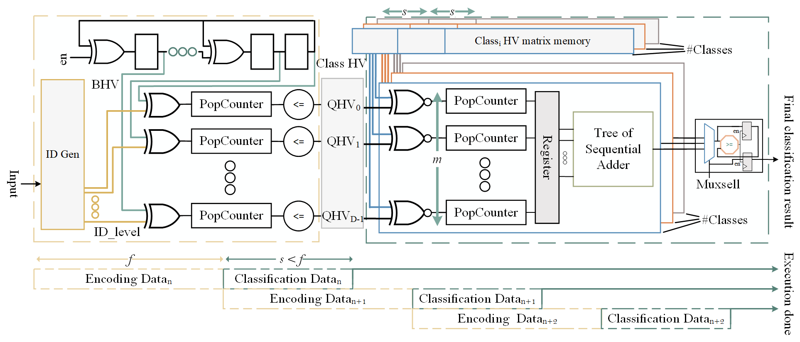

RE3HDC Architecure 
=======

The following is an overview of the RE3HDC hardware architecture, which consists of the typical two main stages: encoding and classification.
Our main goals for the hardware architecture are reconfigurability and low resource consumption without sacrificing throughput. This is achieved through highly flexible VHDL constructs and a sophisticated pipeline design.

In the following a thorough explanation of each stage and their pipeline structure is geven.

Encoding
--------

During encoding, the dimension of the input is transformed into hyperspace, which is done feature by feature in this architecture. 
During the _binding_ part of encoding, we generate an HV for each input feature per clock cycle.
In the_bundling_ phase, the feature-dependent HVs are then fed directly into an array of sequential PopCount modules. 
After iterating over all features in the input, the results of the PopCounts are binarized and stored in the registers as the encoded QHV for classification.

Thus, the encoding in our architecture requires _f_ clock cycles, where _f_ is the number of features in the input vector.
Note that the dimension size impacts resource utilization, but not latency/throughput.

Classification
---------------

The classification stage consists of two parts, computing the similarities between QHV and CHVs, and comparing the similarity values.
The generated QHV from the encoding stage is now compared with all pre-stored CHVs which is done with an array of XNORs and PopCounters for all classes simultaneously.
The results of the similarity calculations between QHV and CHVs are stored in registers and compared one by one sequentially.

To improve the efficiency of our design, we design a two-stage pipeline, which means the classification stage must be synchronized with the previous stage.
The following subsection discusses the design of this pipeline and the timing of the operations of the two stages.

Pipeline
---------------

The proposed two-stage pipeline is adjusted based on the number of features (_f_). In the encoding stage, the number of XNOR and sequential PopCount modules in the encoding part is equal to the dimension size or _d_ and they need to iterate feature size (_f_) times to cover all features of the input. 
The rest of the pipeline is adjusted based on these two parameters as well. 
When all input features are fully processed after _f_ clock cycles, the QHV result is stored in a register file after encoding to be processed by classification, and at the same time, the encoding module can start a new processing on the next input data in the queue.

To form a pipeline structure, the classification stage must operate in less than/equal to _f_ clock cycles to iterate over all elements of the current QHV before the next input is generated. 
Since the size of the QHV is usually much larger than the size of the features (_f_ << _d_), the QHV must be divided into equal segments of size _s_, where (\(s \leq f\)).
Since all segments must operate simultaneously, it is necessary to have multiple (_m_) XNORs and PopCounts for each class.
A central controller controls all operations for all classes and allows simultaneous access to different units of CHV with an equivalent pointers, as well as for the memory of class HVs, and normally the last segment of class HVs requires zero padding.
Therefore, to select the appropriate value for _s_, we must consider that _s_ can be chosen between any power of two numbers (because of the memory segments) less than _f_, with a tradeoff between the number of XNORs and PopCounts of each class (_m_) and the zero padding of the memory for the last segment of the class memory QHV. 
In other words: $s = 2^n, s \leq f, d \leq m \times s$.

After counting the similarity of the segments independently, they are joined together using a tree of sequential adders, that are also pipelined and operate at the same level as the similarity count.
%after counting the similarities in the segments.
Since the number of classes is always smaller than the number of features (\textit{f}), the similarity count can be performed with a single sequential comparison.

Hardware Optimization
----------
To improve the efficiency of the processing hardware in HDC, we investigate the possibility of eliminating the calculations based on the classification nature in \ac{HDC}.
In HDC, the classification results do not depend on exact similarity scores, but on the relative similarity of classes within the CHV by detecting the most similar one.
By considering the importance of relative scores over absolute scores in the classification results, it becomes notable that certain elements within all CHVs have identical effects on all categorization results.

For this purpose, an analysis of all \acp{CHV} is performed after training and quantization, and all their comparable elements are retrieved based on their respective positions.
Subsequently, the XOR+Popcount operations associated with these elements are pruned from the encoding part of the architecture. 
As a result, they are no longer included in the generated \ac{QHV}. 
At the same time, all these components are also pruned from \acp{CHV}, resulting in the entire hardware functioning in a reduced dimension space.

In summary, we can identify the most important dimensions and perform computations only on them to reduce the hardware, with no impact on the classification result and thus, ensure an efficient hardware utilization.
