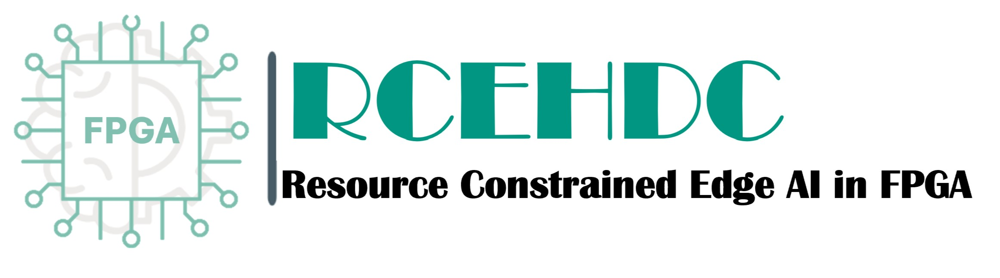

****
RCD_E3HDC
****

Welcome to the RCD_E3HDC documentation!
=====================================

RCD_E3HDC is a framework dedicated to mapping *Hyperdimensional Computing* also known as *Vector Symbolic Architectures* to FPGA.

==============
.. image:: img/RCD_E3HDC-stack.png
   :scale: 15%
   :align: center
   
The ROC-E3HDC project is an experimental framework for the implementation of HDC on PYNQ. The main components of $RPC-E^3HDC$ are shown in the figure above and can be described as follows:
- An end-to-end framework from an open-source HDC training library (Torchhd)--link to TorchHD? down to generating bitstream on hardware.
- Supports a special parameter generating on the fly to make small FPGAs suitable for different tasks.
-architectures customized for each network.

- The ROC-E3HDC compiler which maps trained binary-HDC from TorchHD to PYNQ-Z2 FPGA automatically.  
- An adjustable pipeline architecture based on the problem size suitable for various FPGA edge devices and platforms.
- A fully reconfigurable and parameterized hardware in VHDL that can be matched to any problem and size only by setting the parameters and initial values.
--pruning-non done yet- An automatic optimization on the HDC model for efficient hardware mapping by eliminating the ineffective elements without sacrificing accuracy.
 
More RCD_E3HDC Resources
===================

* `The RCD_E3HDC examples repository <https://github.com/RCD_E3HDC-examples>`_

* `List of publications <https://xilinx.github.io/RCD_E3HDC/publications>`_
 
 
.. toctree::
   :glob:
   :maxdepth: 3
   :caption: Tutorials

   getting_started with RCD_E3HDC
   tutorials
   E3HDC encoding
   E3HDC paramiter generating
   hardware discription
   end_to_end_flow
   source_code/RCD_E3HDC
